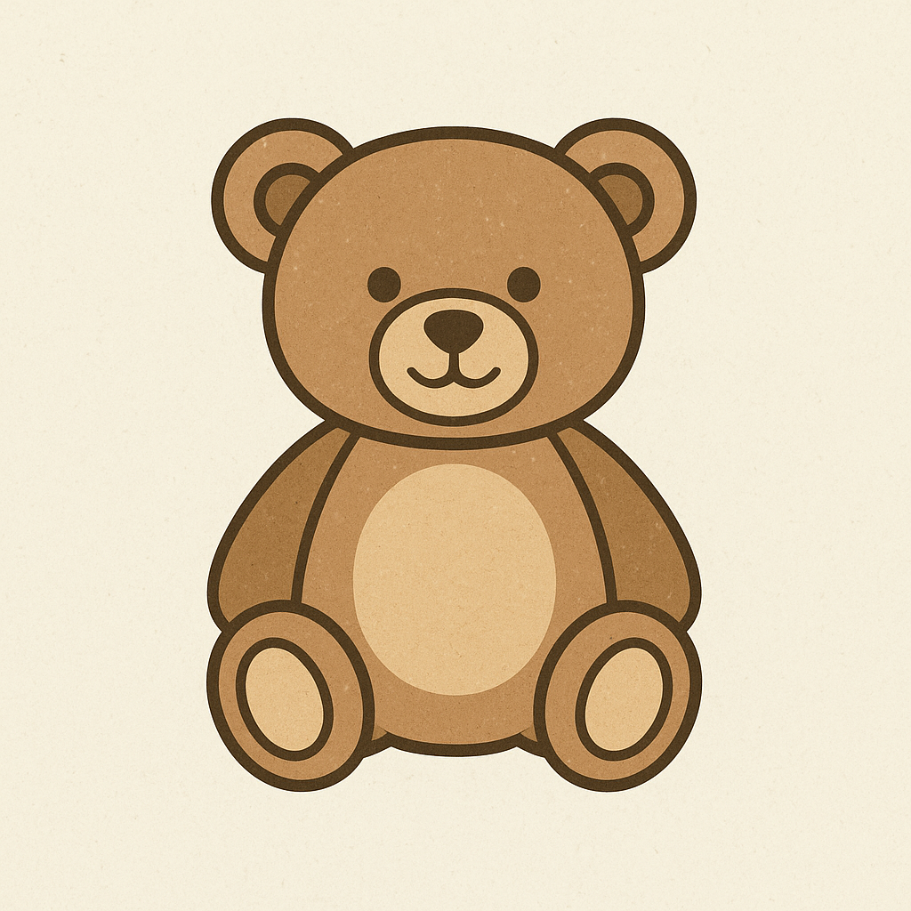

<h1 align="center">
  
  ToyTopia
</h1>

  A modern toy marketplace web app built with React, Firebase, and Tailwind CSS — 
  offering user authentication, category browsing, product management, and smooth UI animations.

<h2>🎯 Project Purpose</h2>

  <b>ToyTopia</b> is an interactive web application designed for toy enthusiasts to explore, 
  add, update, and manage toys. It provides a secure authentication system using Firebase, 
  and an elegant UI enhanced with Swiper sliders and toast notifications.

<h2>🔗 Live URL</h2>

  <a href="https://toytopia-ff3a7.web.app/" target="_blank">Visit Here</a>

<h2>✨ Key Features</h2>
<ul>
  <li>Responsive and visually appealing design using <b>Tailwind CSS + DaisyUI</b></li>
  <li>User Authentication (Login, Register, Logout) using <b>Firebase</b></li>
  <li><b>Password Reset</b> feature integrated with Firebase Authentication</li>
  <li>Product listing, search, and sorting functionality</li>
  <li>Dynamic toy details page with route parameters</li>
  <li>Private routes for authenticated users</li>
  <li>Interactive sliders using <b>Swiper</b> for banners or testimonials</li>
  <li>Toast notifications for actions using <b>react-hot-toast</b></li>
  <li>404 Error Page for invalid routes</li>
</ul>

<h2>🗂️ Pages Overview</h2>

<h3>🏠 Home Page</h3>
<ul>
  <li>Hero section with a responsive Swiper slider</li>
  <li>Featured toy categories</li>

</ul>

<h3>🧸 All Toys Page</h3>
<ul>
  <li>Displays all toys fetched from the server</li>
  
</ul>

<h3>🔍 Toy Details Page</h3>
<ul>
  <li>Detailed view of each toy’s image, name, seller info, and description</li>
  <li>Accessible only to logged-in users (Protected Route)</li>
</ul>

<h3>👤 Authentication Pages</h3>
<ul>
  <li>Login and Register forms with Firebase authentication</li>
  <li>Password Reset page that sends reset email via Firebase</li>
  <li>Real-time success and error feedback using toast notifications</li>
</ul>

<h3>➕  Manage Toys Page</h3>
<ul>
  <li>Add new toy information via form</li>
  <li>Update or delete your added toys</li>
</ul>

<h3>🚫 404 Error Page</h3>
<ul>
  <li>Beautifully styled page for invalid routes</li>
</ul>

<h2>🛠️ Technologies & Packages Used</h2>

<table>
  <tr><th>Category</th><th>Tools / Libraries</th></tr>
  <tr><td>Frontend Framework</td><td>React.js</td></tr>
  <tr><td>Routing</td><td>React Router DOM</td></tr>
  <tr><td>UI Framework</td><td>Tailwind CSS, DaisyUI</td></tr>
  <tr><td>Animations / Effects</td><td>Swiper</td></tr>
  <tr><td>Authentication</td><td>Firebase Authentication</td></tr>
  <tr><td>Notifications</td><td>React Hot Toast</td></tr>
  <tr><td>State Management</td><td>React useState, useEffect, Context API</td></tr>
  <tr><td>Deployment</td><td>Netlify</td></tr>
</table>

<h2>📦 Installation & Setup</h2>
<pre>
git clone https://github.com/yourusername/toytopia.git
cd toytopia
npm install
npm run dev
</pre>

<h2>📄 License</h2>

This project is licensed under the MIT License.

  🚀 Developed by <b>Moni</b>

